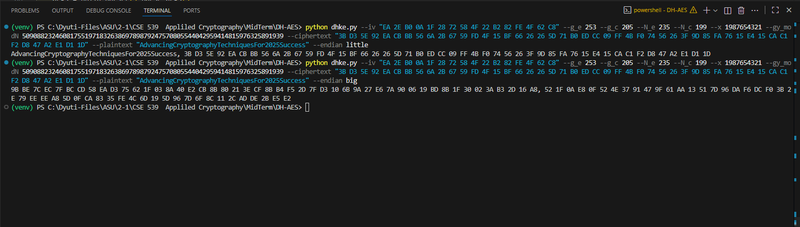

# 🔐 Diffie-Hellman + AES-256 (CBC) Encryption Tool

This project implements a **secure cryptographic pipeline** combining **Diffie-Hellman key exchange** and **AES-256 (CBC)** encryption.  
It was developed as part of **CSE 539 - Applied Cryptography (Fall 2025)** coursework.

The tool allows users to:
- Derive a **shared secret key** using Diffie-Hellman modular exponentiation.
- Encrypt and decrypt messages using **AES-256 in CBC mode**.
- Handle both **little-endian** and **big-endian** byte orders for flexibility.
- Work entirely via **command-line arguments** for reproducible testing.

---

## 📁 Project Structure

| File | Description |
|------|--------------|
| `dhke.py` | Main Python script implementing Diffie-Hellman + AES-256 pipeline. |
| `requirements.txt` | Python dependencies for the project. |
| `solution.png` | Screenshot showing program output (decryption + encryption results). |
| `solution2.png` | Additional output example or verification screenshot. |
| `README.md` | Project documentation and usage instructions. |

---

## ⚙️ Installation

### 1. Clone the repository
```bash
git clone https://github.com/yourusername/DH-AES-Tool.git
cd DH-AES-Tool
```

### 2. Set up Python environment
Ensure you are using Python 3.8+.
```bash
python3 -m venv venv
source venv/bin/activate   # on macOS/Linux
venv\Scripts\activate      # on Windows
```
### 3. Install dependencies
```bash
pip install -r requirements.txt
```

## 🧩 Dependencies
Listed in requirements.txt:
```bash
pycryptodome
cryptography
```
These provide:
- AES encryption/decryption primitives.
- Secure padding and key operations.

## 🔢 How It Works

The program performs the following steps:

### 1. Compute Parameters
$$
g = 2^{g_e} - g_c
$$

$$
N = 2^{N_e} - N_c
$$

### 2. Generate Shared Secret
$$
\text{shared-secret} = (g^y \bmod N)^x \bmod N
$$

### 3. Convert Shared Secret → 32-byte AES Key
- Converts the shared secret integer into a **32-byte AES-256 key**.
- Supports both **little-endian** and **big-endian** byte orders.

### 4. Decrypt Ciphertext
- Uses **AES-256-CBC** mode with the provided **IV**.
- If UTF-8 decoding fails, the decrypted bytes are displayed as a **hex string**.

### 5. Encrypt Plaintext
- Uses the same **shared key** and **IV** to produce a new ciphertext.

### 6. Output Results
- Prints both the **decrypted text (or hex)** and the **newly encrypted ciphertext**.

## 🧮 Command-Line Usage
Example:
```bash
python dhke.py \
  --iv "00 11 22 33 44 55 66 77 88 99 AA BB CC DD EE FF" \
  --g_e 16 --g_c 3 \
  --N_e 32 --N_c 15 \
  --x 12345 \
  --gy_modN 67890123 \
  --ciphertext "5A 6B 7C 8D 9E AF B0 C1 D2 E3 F4 05 16 27 38 49" \
  --plaintext "Hello AES world" \
  --endian little
```

### 📤 Output Example
Output format:
```bash
<decrypted_text_or_hex>, <new_encrypted_ciphertext_hex>
```
Example output:
```bash
Hello from server, 8F 1A 3C 56 9B 2E A4 10 7F 3E 92 1D 84 55 C0 9A
```
You can view screenshots (solution.png, solution2.png) for visual results.

## 🧪 Example Test Commands and Expected Outputs

Below are example test cases to verify that your **Diffie-Hellman + AES-256 (CBC)** implementation works correctly.

---

### 🧩 Example 1 — Little Endian (Default)

**Command:**
```bash
python3 dhke.py \
--iv "EA 2E B0 0A 1F 28 72 58 4F 22 B2 82 FE 4F 62 C8" \
--g_e 253 \
--g_c 205 \
--N_e 235 \
--N_c 199 \
--x 1987654321 \
--gy_modN 50908823246081755197183263869789879247570805544042959414815976325891939 \
--ciphertext "3B D3 5E 92 EA CB BB 56 6A 2B 67 59 FD 4F 15 BF 66 26 26 5D 71 B0 ED CC 09 FF 4B F0 74 56 26 3F 9D 85 FA 76 15 E4 15 CA C1 F2 D8 47 A2 E1 D1 1D" \
--plaintext "AdvancingCryptographyTechniquesFor2025Success" --endian little
```
Expected Output:
```bash
AdvancingCryptographyTechniquesFor2025Success, 3B D3 5E 92 EA CB BB 56 6A 2B 67 59 FD 4F 15 BF 66 26 26 5D 71 B0 ED CC 09 FF 4B F0 74 56 26 3F 9D 85 FA 76 15 E4 15 CA C1 F2 D8 47 A2 E1 D1 1D
```
Explanation:
- Inputs: initialization vector, g_e, g_c, N_e, N_c, secret exponent x, peer’s g^y mod N, ciphertext C, plaintext P.
- Outputs: decrypted text and encrypted cipher.
- This example uses the little-endian key representation.
---

---
🧮 Example 2 — Big Endian Key Variant

**Command:**
```bash
python dhke.py \
--iv "EA 2E B0 0A 1F 28 72 58 4F 22 B2 82 FE 4F 62 C8" \ 
--g_e 253 \ 
--g_c 205 \
--N_e 235 \
--N_c 199 \
--x 1987654321 \
--gy_modN 50908823246081755197183263869789879247570805544042959414815976325891939 \
--ciphertext "3B D3 5E 92 EA CB BB 56 6A 2B 67 59 FD 4F 15 BF 66 26 26 5D 71 B0 ED CC 09 FF 4B F0 74 56 26 3F 9D 85 FA 76 15 E4 15 CA C1 F2 D8 47 A2 E1 D1 1D" \
--plaintext "AdvancingCryptographyTechniquesFor2025Success" --endian big
```
```
Expected Output:
```bash
9B BE 7C EC 7F BC CD 58 EA D3 75 62 1F 03 8A 40 E2 CB 8B 80 21 3E CF 8B B4 F5 2D 7F D3 10 6B 9A 27 E6 7A 90 06 19 BD 8B 1F 30 02 3A B3 2D 16 A8, 52 1F 0A E8 0F 52 4E 37 91 47 9F 61 AA 13 51 7D 96 DA F6 DC F0 3B 2E 79 EE EE A8 5D 0F CA 83 35 FE 4C 6D 19 5D 96 7D 6F 8C 11 2C AD DE 2B E5 E2
```

##  Screenshot References:

output1.png — Whole Code


output2.png — Zoomed on Output

--- 

### 🧠 Key Functions Overview
| Function                       | Description                                                 |
| ------------------------------ | ----------------------------------------------------------- |
| `hex_bytes(s: str)`            | Converts hex string to bytes.                               |
| `to_hex_with_spaces(b: bytes)` | Converts bytes to hex string with spaces.                   |
| `calculate_shared_key()`       | Implements the Diffie-Hellman shared key formula.           |
| `_key_bytes_from_int()`        | Converts integer to 32-byte key (for AES-256).              |
| `encrypt()`                    | AES-256-CBC encryption with padding.                        |
| `decrypt()`                    | AES-256-CBC decryption with UTF-8 decoding or hex fallback. |
| `build_parser()`               | CLI argument parser.                                        |
| `main()`                       | Main entry point that executes the full pipeline.           |

## 🧪 Testing
You can verify encryption-decryption symmetry by:
- Encrypting a known plaintext.
- Decrypting the resulting ciphertext with the same parameters.

##⚠️ Error Handling
- Invalid IV length → Raises ValueError.
- Invalid hex string → Raises argparse.ArgumentTypeError.
- Non-positive modulus 𝑁 → Raises ValueError.
- UTF-8 decoding errors → Falls back to hex output.

## 🧭 Endianness Notes
- Little Endian: Least significant byte first — default mode.
- Big Endian: Useful for verifying reverse key interpretations.
Try both modes if your decrypted message appears unreadable.

## 👩‍💻 Author
[Dyuti Mengji](https://github.com/DyutiM25)


